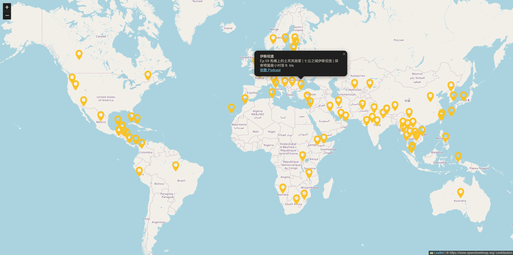

# Unlock the Earth

**Unlock the Earth** is a web-based visualization project that maps the content of the Taiwanese podcast 《解鎖地球》("Unlock the Earth"). The goal is to present podcast episodes in an interactive and geographical format, allowing users to explore stories and insights from around the world through a visual interface.

## Project Purpose

This project transforms the rich travel and cultural content of the podcast into a map-based experience. Each episode is linked to a specific country or city, helping users discover global destinations and their stories in an intuitive and engaging way.

## TODO
* [ ] Complete all the episodes into database (112/246).
* [ ] Search and filter episodes by region or keyword.
* [ ] Automatically fetch and insert the latest episode into the database every week.

# Live Demo
[👉 Check it out here](https://robert6217.github.io/unlock_the_earth/)

# Listen to the Podcast

